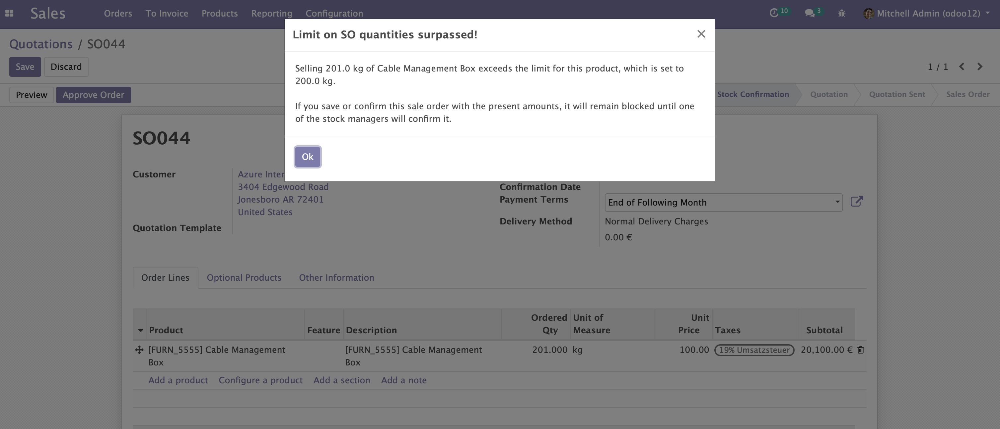
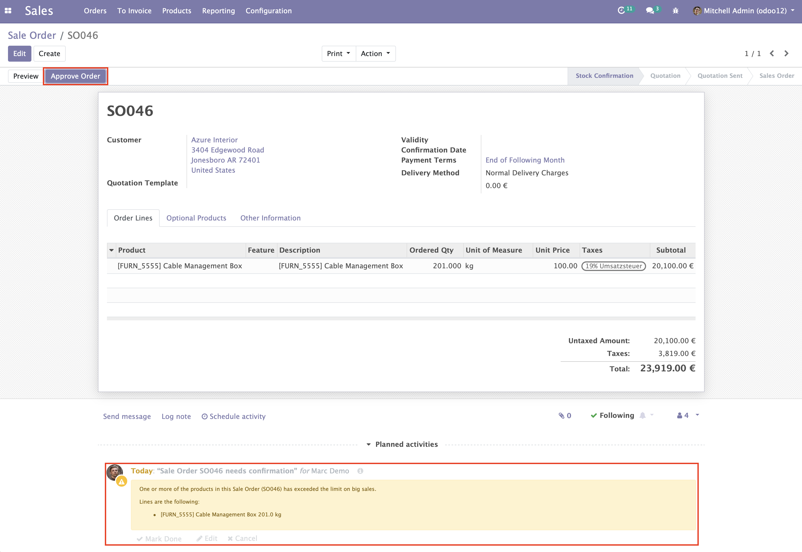

    <a href="https://www.odoo.com/documentation/12.0/index.html">
        </img>
    </a>
    <a href="http://www.alliantum.com">
        </img>
    </a>
    <a href="http://www.gnu.org/licenses/agpl-3.0-standalone.html">
        </img>
    </a>

    
    

        <h1>Order Confirmation</h1>
        Block a SO until Stock Managers allow it depending on maximum amounts
        

    

## Usage

Install this add-on and it will be automatically ready to use.

- A warning message alerts the user that the Ordered Qty exceeds the limit
    

        
    

- A Stock Manager has to approve the sale order
    

        
    

## Contributors

- [Alliantum](http://www.alliantum.com)
